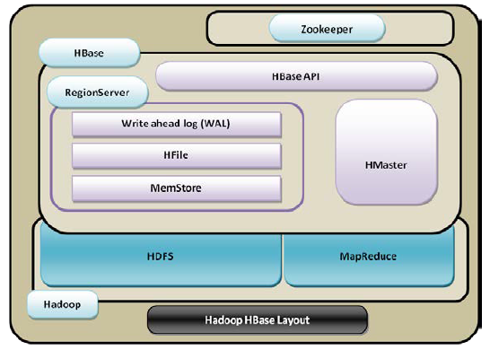

# Learning-HBase
## Understanding the HBase Ecosystem
### What is HBase?
Hbase is a column-based database that runs on top of Hadoop distributed filesystem and supports features such as linear scalability(scale out), automatic failover, automatic sharding, and more flexible schema.
##### Features
* Column-based {Refer-> [Row VS Column Oriented DB](https://www.youtube.com/watch?v=Vw1fCeD06YI&t=724s) } 
* Horizontally scalable
* Distributed (as it is running on top of hadoop(hdfs))
* Open-Source
* Sorted map database

### HBase layout on top of Hadoop

Hbase can be seen as **master-slave** database.
* Master = HMaster (responsible for coordination between client application and HRegionserver.)
* Slave(s) = HRegionsevers(which serve the actual tables in th form of regions.)

###Comparing architectural differences between RDBMs and HBase
| Relational databases     | HBase          |
| ------------------------------------------------| -------------------------------------------------- |
| Uses tables as databases                        | Uses regions as databases|
| File systems supported are FAT, NTFS, and EXT   | File system supported is HDFS |
| The technique used to store logs is commit logs | The technique used to store logs is Write-Ahead Logs (WAL) |
| The reference system used is coordinate system  | The reference system used is ZooKeeper |
| Uses the primary key Uses the row key           | Partitioning is supported Sharding is supported |
| Use of rows, columns, and cells                 | Use of rows, column families, columns, and cells   |
