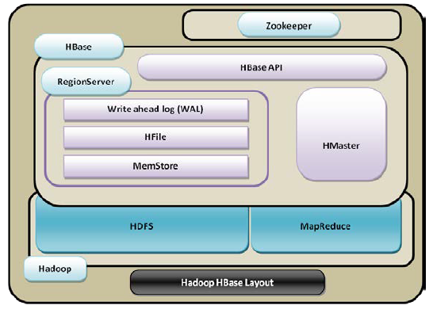
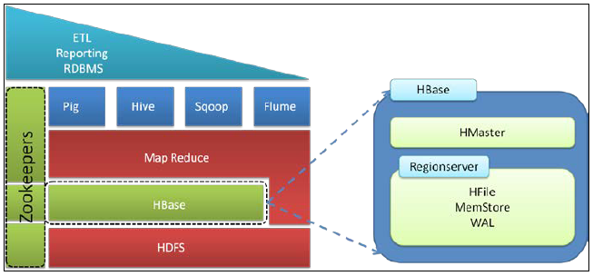
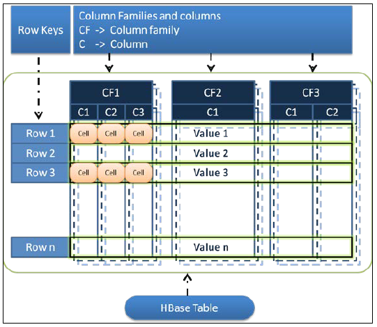

# Learning-HBase
## Understanding the HBase Ecosystem
### What is HBase?
Hbase is a column-based database that runs on top of Hadoop distributed filesystem and supports features such as linear scalability(scale out), automatic failover, automatic sharding, and more flexible schema.

### HBase layout on top of Hadoop

Hbase can be seen as **master-slave** database.
* Master = HMaster (responsible for coordination between client application and HRegionserver.)
* Slave(s) = HRegionsevers(which serve the actual tables in th form of regions.)

### Comparing **_architectural_** differences between RDBMs and HBase
| Relational databases     | HBase          |
| ------------------------------------------------| -------------------------------------------------- |
| Uses tables as databases                        | Uses regions as databases|
| File systems supported are FAT, NTFS, and EXT   | File system supported is HDFS |
| The technique used to store logs is commit logs | The technique used to store logs is Write-Ahead Logs (WAL) |
| The reference system used is coordinate system  | The reference system used is ZooKeeper |
| Uses the primary key Uses the row key           | Partitioning is supported Sharding is supported |
| Use of rows, columns, and cells                 | Use of rows, column families, columns, and cells   |

### HBase Features
* Automatic failover and load balancing
* Automatic sharding
* Hadoop/HDFS integration
* Real-Time, random big data access
* MapReduce
* Java API for client access
* Support for exporting metrics vis Hadoop matrices subsystem.
* Distributed
* Linear scalability (scale out)
* Column Oriented {Refer-> [Row VS Column Oriented DB](https://www.youtube.com/watch?v=Vw1fCeD06YI&t=724s) }
* HBase-shell support
* Sparse multidimensional, sorted map database
* Snapshot support

### HBase in the Hadoop ecosystem

As we know, Hadoop provides two services:-
* a Distributed file system(**HDFS**) for storage.
* **MapReduce** framework for processing in a parallel mode.

(**Why we needed HBase**)
When there was a need to store structured data (data in the form of tables, rows and columns), which most of the programmers are already familiar with, the programmers were finding it difficult to process the data that was stored on HDFS as an unstructured flat file format. This led to the evolution of HBase, which provided a way to store data in a structural way.

### Data Representation in HBase

Hbase table is divided into rows, columns families, columns and cells.

***Row Keys*** -> uniquely identify a row

***Column Families*** -> Group of columns

***Columns*** -> fields of the table

***Cell*** -> actual value/data

## Some fundamentals about Hadoop which helps us understand HBase more clearly.

Hadoop is the underlying technology of HBase.
#### Features of Hadoop:
* High availability
* Fault Tolerance
* Distribution
* MapReduce Framework(for parallel processing)
* HDFS(for large-scale storage with high throughput on R/W operations, rapid data access)
* YARN(for job scheduling, and job and resource management)

#### [Core Daemons](https://www.geeksforgeeks.org/hadoop-daemons-and-their-features/) if Hadoop:  
* **NameNode** -> ***Master*** -> Single POC which manages all metadata about the data present on the cluster
* **DataNode** -> ***Slave*** -> Contains actual data
* **Jobtracker**/**ResouceManager** -> Runs on NameNode, performs MR jobs
* **Secondary NameNode** ->Maintains backups of NameNode
* **TaskTracker**/**NodeManager** -> Performs the tasks

#### Comparing HBase with Hadoop
|Hadoop/HDFS |  HBase |
| ------------------------------------------------| -------------------------------------------------- |
|This provide file system for distributed storage | This provides tabular column-oriented data storage
|This is optimized for storage of huge-sized files with no random read/write of these files |This is optimized for tabular data with random read/write facility
|This uses flat files |This uses key-value pairs of data |
| The data model is not flexible Provides a flexible data model |This uses file system and processing framework This uses tabular storage with built-in Hadoop MapReduce support
|This is mostly optimized for write-once read-many | This is optimized for both read/write many|

#### Comparing _**functional**_ differences between RDBMs and HBase
|Relational database |HBase|
| ------------------------------------------------| -------------------------------------------------- |
| This supports scale up. In other words,when more disk and memory processing power is needed, we need to upgrade it to a more powerful server. | This supports scale out. In other words, when more disk and memory processing power is needed, we need not upgrade the server. However, we need to add new servers to the cluster.|
| This uses SQL queries for reading records from tables. | This uses APIs and MapReduce for accessing data from HBase tables.|
| This is row oriented, that is, each row is a contiguous unit of page. | This is column oriented, that is, each column is a contiguous unit of page.|
| The amount of data depends on configuration of server.| The amount of data does not depend on the particular machine but the number of machines.|
| It's Schema is more restrictive. | Its schema is flexible and less restrictive.|
| This has ACID support. | There is no built-in support for HBase. |
| This is suited for structured data.| This is suited to both structured and nonstructural data.| 
| Conventional relational database is mostly centralized. | This is always distributed.| 
| This mostly guarantees transaction integrity. | There is no transaction guaranty in HBase.| 
| This supports JOINs. | This does not support JOINs.|
| This supports referential integrity. |There is no in-built support for referential integrity.|

#### Why and how Column Based approach is the best choice
Let's understand this by taking one example:

If one row occupies a page, and we need all specific column such as _salary_ or _rate of interest_ from all the rows for some kind of analytics, each page containing the columns has to be brought in the memory;so this page in and page out will result in a lot of I/O, which may result prolonged processing time.

In column-oriented databases, each column will be stored in pages. If we need to fetch a specific column, there will be less I/O as only the pages that contain the specified column needed t be brought in main memory and read, and we need not bring and read all the pages containing rows/records henceforth into the memory. That's why Column oriented approach.

### Internal architecture of HBase
HBase stores file using **LSM-tree**, which maintains data in two separate parts that are optimized for underlying storage. This type of data structure depends on two structures, a current and smaller one in memory and a bigger one on the persistent disk, and once the part in memory becomes bigger than a certain limit, it is merged with the bigger structure that is stored on the disk using a merge sort algorithm and a new in-memory tree is created for newer insert requests. It transforms random data access into sequential data access, which improves read performance, and merging is a background process, which does not affect the foreground processing.

### An overview on HBase's components and functionalities
* Zookeeper 
  * A centralized service for providing configuration information, naming, synchronization and group services over large clusters in distributed systems.
* HMaster 
  * Acts as Master in master-slave architecture
  * Monitors RegionServers
  * Handles RegionServers failover.
  * Handles metadata changes.
  * Assignment/unassignment of regions.
  * Interface all metadata changes.
  * Performs reload balancing in idle time.
  * It publishes its location to client using Zookeeper.
  * HMaster Web UI provides all the information about HBase cluster(table, regions, RegionServers adn so on).
  * There may be one or many HMaster(many for High Availability in case or hazard).
* RegionServer
  * Acts as Slave(s) in master-slave architecture.
  * Serving Regions(tables) assign to it by HMaster.
  * Handling client R/W requests.
  * Maintaining Hlogs.
  * Performing Compaction(merge).
  * Responsible for handling region splits.
* Client
  * Responsible for finding the RegionServer which is hosting a particular ros(data/record).
* Catalog tables
  * Contains all the info about all the RegionServers and Regions.

#### When to choose HBase and when not!!!
When to:
* If data needs to have a dynamic or variable schema
* If a number of columns contain more null values (blank columns)When we have a huge number of dynamic rows
* If our data contains a variable number of columns
* If we need to maintain versions of data
* If high scalability is needed
* If we need in-built compression on records
* If a high volume of I/O is needed

When NOT:
* When data is not in large amounts (in TBs and more)
* When JOINs and relational DB features are needed
* Don't go with the belief "every one is using it"
* If RDBMS fits your requirements, use RDBMS

### PROs ans CONs of HBase
**Pros**:
* Great for analytics in association with Hadoop MapReduce
* It can handle very large volumes of data
* Supports scaling out in coordination with Hadoop file system even on commodity hardware
* Fault tolerance
* License free
* Very flexible on schema design/no fixed schema
* Can be integrated with Hive for SQL-like queries, which is better for DBAs who are more familiar with SQL queries
* Auto-sharding
* Auto failover
* Simple client interface
* Row-level atomicity, that is, the PUT operation will either write or fail

**Cons**:
* Single point of failure (when only one HMaster is used)
* No transaction support
* JOINs are handled in MapReduce layer rather than the database itself
* Indexed and sorted only on key, but RDBMS can be indexed on some arbitrary field
* No built-in authentication or permissions
